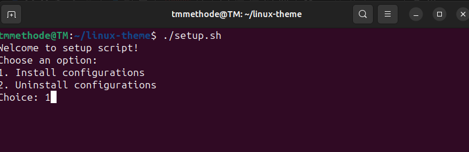
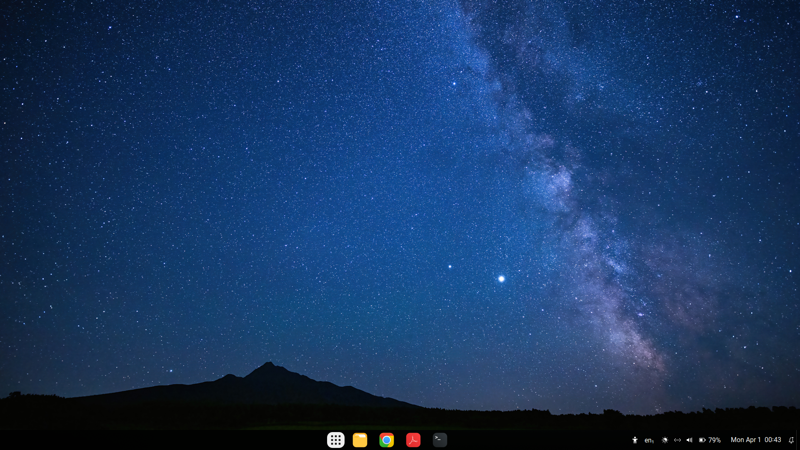
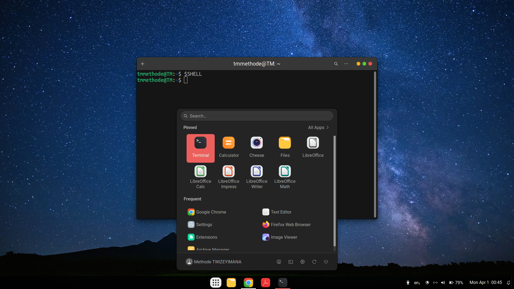
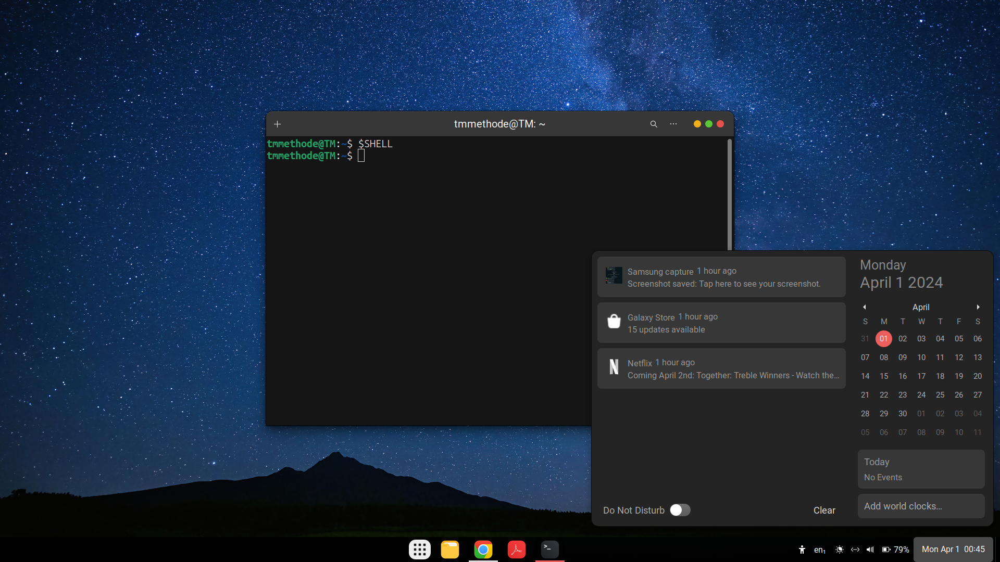
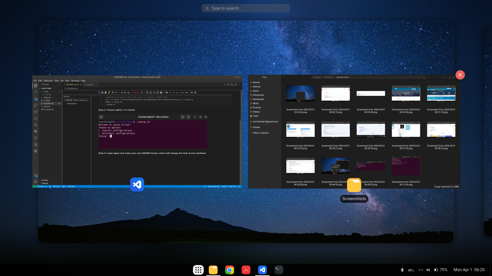

# GNOME Theme Setup Script

This script allows you to easily set up and configure a GNOME theme for your Linux desktop environment. When installed, the GNOME theme will change the look and feel of your desktop.

## Installation

To install the GNOME theme setup script, run the following commands in your terminal:

 **1: Download and execute setup using the following codes:**

```bash
# Download and execute the setup script to install a GNOME theme.
curl -sL https://raw.githubusercontent.com/tmmethode/linux-theme/main/setup.sh -o setup.sh
chmod +x setup.sh
./setup.sh
```

**Step 2: Choose option 1 to install.**



**Step 3: Login again and enjoy your new GNOME theme, which will change the look of your desktop!**





